# はじめに

[前回の記事](https://qiita.com/hisaho/items/4b925b07ef82109fd7c7)では、AI for Scienceの基盤技術としてLazyGraphRAGを紹介しました。本記事はその続編として、**Baseline GraphRAG** と **LazyGraphRAG** の違いを整理した上で、さらにその先にある新しいアーキテクチャパターンを提案します。

:::note
**注記**: 本記事で紹介する **Unified GraphRAG** と **Progressive GraphRAG** は、筆者が考案した新しいアーキテクチャパターンです。既存の Baseline GraphRAG と LazyGraphRAG の長所を活かしつつ、実システムへの導入における課題を解決することを目指しています。
:::

## TL;DR

| アーキテクチャ | 一言で言うと | 向いているケース | 備考 |
|---------------|-------------|-----------------|------|
| **Baseline RAG** | チャンク検索 + 生成 | シンプル、低コスト | 既存手法 |
| **GraphRAG** | グラフ構築 + 検索 | グローバル質問、高品質 | Microsoft Research |
| **LazyGraphRAG** | 遅延グラフ + 動的抽出 | 探索的、コスト効率 | Microsoft Research |
| **Hybrid** | 両方実行してマージ | 網羅性最優先 | 一般的手法 |
| **Unified** | 賢く選んで実行 | 運用効率重視 | 💡 **本記事で提案** |
| **Progressive** | 必要な深さまで掘る | コスト最適化 | 💡 **本記事で提案** |

# 1. RAG vs GraphRAG：基本的な違い

まず、**Baseline RAG** と **GraphRAG** の根本的な違いを理解しましょう。

## Baseline RAG（従来のRAG）

Baseline RAG は、文書をチャンク（断片）に分割し、ベクトル類似度で検索するシンプルなアプローチです。LLM を使わずに埋め込みモデルのみでインデックスを構築するため、**低コストで高速**に導入できます。

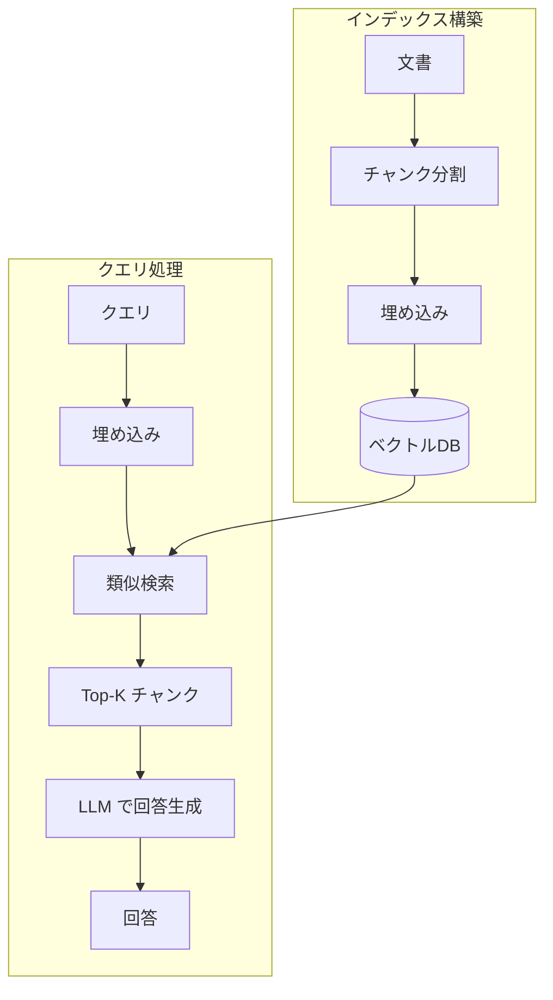

**仕組み**:
1. 文書をチャンク（断片）に分割
2. 各チャンクをベクトル化してDBに保存
3. クエリもベクトル化し、類似度で検索
4. 上位K件のチャンクをLLMに渡して回答生成

**特徴**:
| 項目 | 説明 |
|------|------|
| 💰 コスト | 低（埋め込みのみ） |
| ⚡ 速度 | 高速 |
| 🎯 得意 | 具体的な事実検索（「〇〇の値は？」） |
| ❌ 苦手 | 複数文書にまたがる質問 |

## GraphRAG（グラフベースRAG）

GraphRAG は、文書から**エンティティ（人、場所、概念など）と関係性**を LLM で抽出し、ナレッジグラフを構築するアプローチです。グラフ構造により、複数文書にまたがる情報を統合し、**全体像を俯瞰**するような質問に強みを発揮します。

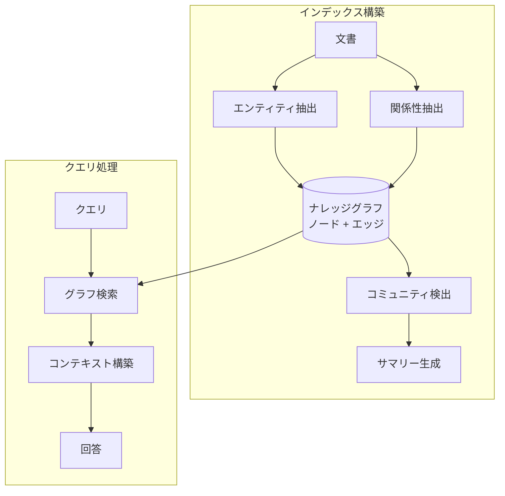

**仕組み**:
1. 文書からエンティティ（人、場所、概念）を抽出
2. エンティティ間の関係性を抽出
3. ナレッジグラフを構築
4. グラフをコミュニティ（クラスタ）に分割
5. 各コミュニティのサマリーを生成
6. クエリに関連するコミュニティから回答

**特徴**:
| 項目 | 説明 |
|------|------|
| 💰 コスト | 高（LLMで抽出・サマリー） |
| ⚡ 速度 | インデックス構築は遅い、クエリは速い |
| 🎯 得意 | グローバル質問（「全体の傾向は？」） |
| ❌ 苦手 | 細かい事実検索 |

## 比較：同じ質問への回答の違い

**質問**: 「このプロジェクトの主要な課題は何ですか？」

| アプローチ | 動作 | 結果 |
|-----------|------|------|
| **Baseline RAG** | 「課題」を含むチャンクを検索 | 断片的な課題リスト（文脈なし） |
| **GraphRAG** | 課題に関連するコミュニティを特定 | 体系的な課題の全体像 |

:::note info
**Baseline RAG の回答例:**
「課題1: パフォーマンスの問題があります。課題2: セキュリティの懸念があります。」
→ 個別のチャンクから抽出、関連性が不明確
:::

:::note info
**GraphRAG の回答例:**
「主要な課題は3つのカテゴリに分類されます。
1. 技術的課題: パフォーマンス、スケーラビリティ
2. 運用課題: セキュリティ、コンプライアンス
3. ビジネス課題: コスト、導入障壁
これらは相互に関連しており...」
→ 構造化された全体像
:::

## いつどちらを使うべきか？

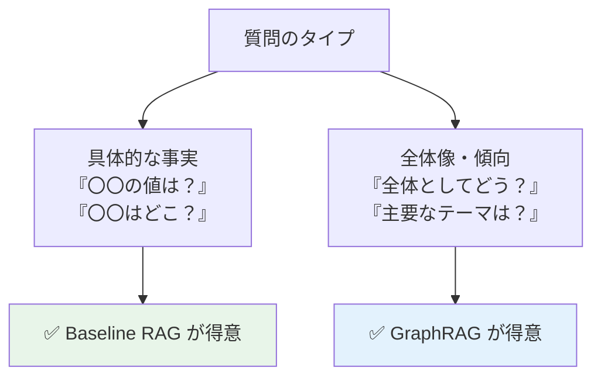

# 2. GraphRAGとLazyGraphRAGの違い

GraphRAGの「事前構築コスト」を解決するために生まれたのが **LazyGraphRAG** です。

## GraphRAG（従来型）

GraphRAG は、インデックス構築時に**すべてのエンティティと関係性を事前に抽出**し、完全なナレッジグラフを構築するアプローチです。構築コストは高いですが、一度構築すれば高速かつ高品質な検索が可能です。

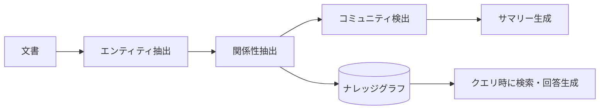

**特徴**:
- 📊 事前に完全なナレッジグラフを構築
- 💰 インデックス構築に高コスト（LLM呼び出し多数）
- ⚡ クエリ時は高速
- 🎯 グローバルな質問に強い

## LazyGraphRAG（遅延型）

LazyGraphRAG は、インデックス構築時には**軽量な処理のみ**を行い、LLM を使った高度な情報抽出は**クエリ時に動的に実行**するアプローチです。「必要になるまで処理を遅延させる」という戦略により、初期コストを大幅に削減できます。

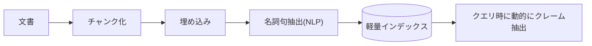

**特徴**:
- 🚀 インデックス構築が高速・低コスト
- 💡 クエリ時にLLMで深掘り
- 📈 探索的なクエリに強い
- 🔄 ワンオフ検索に最適

## 3つのアプローチ比較

| 項目 | Baseline RAG | GraphRAG | LazyGraphRAG |
|------|-------------|----------|--------------|
| **インデックスコスト** | 💰 | 💰💰💰💰💰 | 💰 |
| **クエリコスト** | 💰 | 💰💰 | 💰💰💰 |
| **グローバル質問** | ❌ 苦手 | ✅ 得意 | ✅ 得意 |
| **事実検索** | ✅ 得意 | ⚠️ 普通 | ⚠️ 普通 |
| **繰り返し検索** | ✅ 効率的 | ✅ 効率的 | ❌ 非効率 |
| **ワンオフ検索** | ✅ 効率的 | ❌ 非効率 | ✅ 効率的 |

# 3. Hybrid GraphRAG：両方実行してマージ

## 概念図

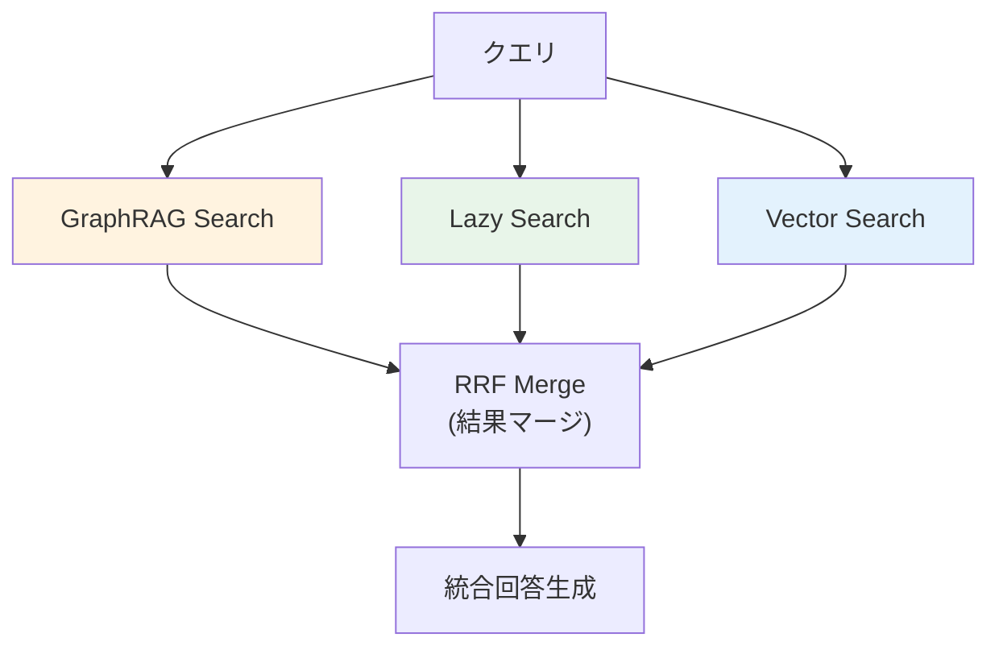

## 仕組み

Hybrid GraphRAG は、複数の検索エンジンを**並列に実行**し、その結果を **統合（マージ）** することで、各エンジンの強みを活かしつつ弱点を補完するアプローチです。

**処理フロー:**
1. **クエリ受信**: ユーザーからの質問を受け取る
2. **並列検索実行**: 以下の3つの検索エンジンを同時に実行
   - **GraphRAG Search**: ナレッジグラフからコミュニティベースで検索（グローバルな文脈に強い）
   - **Lazy Search**: 動的にクレームを抽出して検索（探索的な質問に強い）
   - **Vector Search**: ベクトル類似度で検索（具体的な事実検索に強い）
3. **結果マージ**: **RRF（Reciprocal Rank Fusion）** アルゴリズムで各エンジンの結果を統合
   - 各エンジンでの順位を考慮してスコアを計算
   - 複数エンジンで上位に来た結果ほど高スコア
4. **統合回答生成**: マージされたコンテキストをLLMに渡して最終回答を生成

**RRF（Reciprocal Rank Fusion）とは:**
複数の検索結果をマージする手法で、各結果の順位の逆数を合計してスコアを計算します。これにより、異なる検索エンジンで共通して高評価された結果が優先されます。**Azure AI Search** のハイブリッド検索でも採用されている業界標準の手法です。

```python
class HybridGraphRAG:
    def search(self, query: str) -> HybridResult:
        # 全エンジンを並列実行
        results = await asyncio.gather(
            self.graphrag.search(query),
            self.lazy_search.search(query),
            self.vector_search.search(query),
        )
        
        # Reciprocal Rank Fusion でマージ
        merged = self.rrf_merge(results)
        return merged
```

## メリット・デメリット

Hybrid GraphRAG は「すべてのエンジンを実行する」というシンプルな戦略のため、実装は容易ですが、コストとレイテンシがトレードオフになります。以下に主なメリット・デメリットを整理します。

| メリット | デメリット |
|---------|-----------|
| ✅ 網羅性が最も高い | ❌ コストが最大（全エンジン実行） |
| ✅ 実装がシンプル | ❌ レイテンシが最も長い |
| ✅ どんなクエリにも対応 | ❌ 事前にGraphRAGインデックス必須 |

## 適用場面

Hybrid GraphRAG は、コストよりも**回答の網羅性・正確性**を重視するシナリオに適しています。特に、重要な情報を見落とすことが許されない領域や、システムの性能を正確に評価したい場合に有効です。

- 🏥 医療・法律など見落としが許されない領域
- 📊 ベンチマーク・評価用途
- 💎 品質が最優先でコストは問わない

# 4. Unified GraphRAG：賢く選んで実行【筆者提案】

:::note
💡 **本アーキテクチャは筆者による新規提案です**
:::

GraphRAG と LazyGraphRAG はそれぞれ異なる強みを持っていますが、実運用では「どちらを使うべきか」という判断が必要です。**Unified GraphRAG** は、クエリの特性を分析し、最適な検索エンジンを動的に選択するアーキテクチャです。

## 概念図

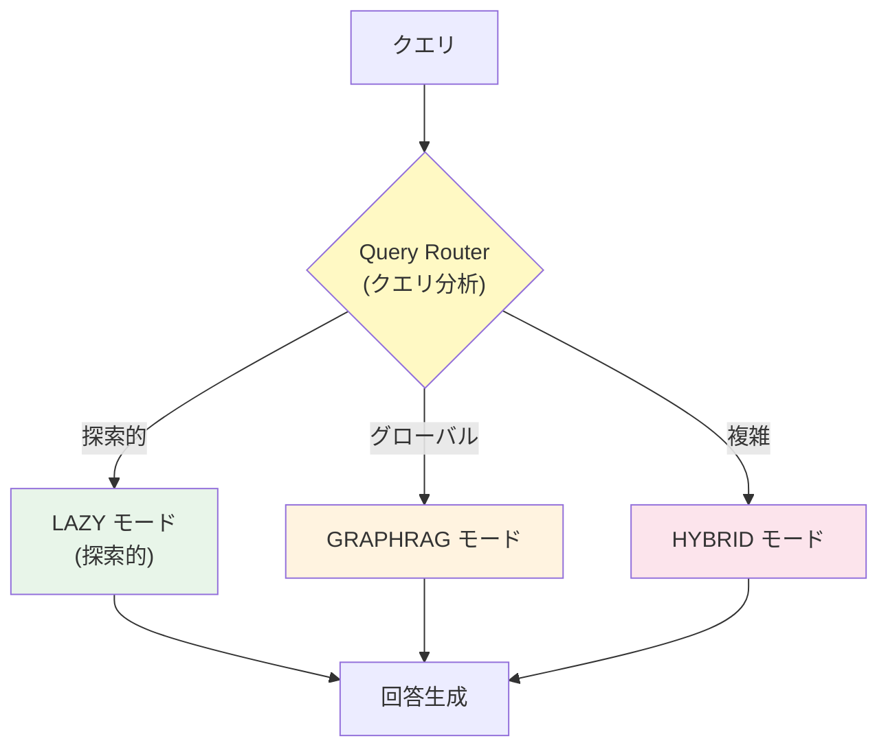

## 仕組み

Unified GraphRAG の核心は **Query Router（クエリルーター）** です。ルーターがクエリの特性を分析し、最適な検索エンジンを動的に選択します。

**処理フロー:**
1. **クエリ受信**: ユーザーからの質問を受け取る
2. **クエリ分類**: Query Router がクエリの種類を判定
   - キーワード分析、質問パターン認識、意図推定などを実行
   - LLM を使った高精度な分類も可能
3. **エンジン選択**: 分類結果に基づいて最適なエンジンを選択
   - **LAZY モード**: 探索的・オープンエンドな質問向け
   - **GRAPHRAG モード**: グローバル・俯瞰的な質問向け
   - **HYBRID モード**: 複雑・多面的な質問向け
4. **検索実行**: 選択されたエンジンのみを実行（コスト削減）
5. **回答生成**: 検索結果からLLMで回答を生成

**Query Router の実装アプローチ:**
- **ルールベース**: キーワードやパターンマッチングで分類（低コスト・高速）
- **ML ベース**: 分類モデルを学習して判定（高精度）
- **LLM ベース**: LLM にクエリを分類させる（最高精度・高コスト）

```python
class UnifiedGraphRAG:
    def search(self, query: str, mode: SearchMode = SearchMode.AUTO):
        if mode == SearchMode.AUTO:
            # クエリを分析して最適なエンジンを選択
            mode = self.router.classify(query)
        
        match mode:
            case SearchMode.LAZY:
                return await self.lazy_search.search(query)
            case SearchMode.GRAPHRAG:
                return await self.graphrag.search(query)
            case SearchMode.HYBRID:
                return await self.hybrid_search(query)

class QueryRouter:
    def classify(self, query: str) -> SearchMode:
        # グローバルな質問 → GraphRAG
        # 探索的な質問 → Lazy
        # 複雑な質問 → Hybrid
        ...
```

## 検索モード選択基準

Query Router がクエリを分類する際の基準を以下に示します。クエリの意図や構造を分析し、最も適切なエンジンを選択します。実際の運用では、これらの基準をルールとして実装するか、学習データとしてモデルに教示します。

| クエリタイプ | 例 | 選択モード |
|-------------|-----|-----------|
| グローバル質問 | 「全体の傾向は？」 | GraphRAG |
| 探索的質問 | 「〇〇について教えて」 | Lazy |
| 比較質問 | 「AとBの違いは？」 | Hybrid |
| ファクト検索 | 「〇〇の値は？」 | Vector |

## メリット・デメリット

Unified GraphRAG は Hybrid と比較してコストを大幅に削減できますが、その効果は **Query Router の精度**に大きく依存します。ルーターが誤ったエンジンを選択すると、回答品質が低下する可能性があります。また、複数のインデックスを管理する運用負荷も考慮が必要です。

| メリット | デメリット |
|---------|-----------|
| ✅ コスト最適化（必要なエンジンのみ） | ❌ ルーター精度に依存 |
| ✅ クエリに応じた最適化 | ❌ 二重インデックス管理 |
| ✅ 運用の柔軟性 | ❌ 設定・チューニングが複雑 |

## 適用場面

Unified GraphRAG は、クエリの種類が多様で、それぞれに最適な検索戦略が異なるような環境で真価を発揮します。特に、コスト効率を維持しながら高品質な回答を提供したい**エンタープライズシステム**に適しています。

- 🏢 エンタープライズ検索システム
- 🔄 多様なクエリパターンがある場合
- 💰 コストと品質のバランスを取りたい

# 5. Progressive GraphRAG：必要な深さまで掘る【筆者提案】

:::note
💡 **本アーキテクチャは筆者による新規提案です**
:::

GraphRAG の最大の課題は「事前のインデックス構築コスト」です。**Progressive GraphRAG** は、インデックスを段階的に構築し、コスト予算に応じて検索の深さを制御するアーキテクチャです。初期コストゼロで開始し、利用状況に応じてインデックスを成長させることができます。

## 概念図

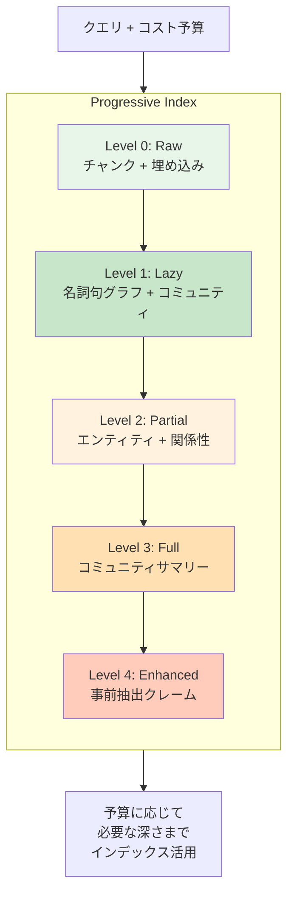

## 仕組み

Progressive GraphRAG の核心は **段階的インデックス（Progressive Index）** と **コスト予算（CostBudget）** の組み合わせです。インデックスは Level 0（最も軽量）から Level 4（最も高機能）まで段階的に構築でき、クエリ時に指定された予算に応じて使用するレベルを決定します。

**処理フロー:**
1. **クエリ受信**: ユーザーからの質問とコスト予算を受け取る
2. **レベル決定**: 予算に応じて使用する最大レベルを決定
   - `MINIMAL`: Level 0-1（探索的・ワンオフ向け）
   - `STANDARD`: Level 0-2（一般的なクエリ向け）
   - `PREMIUM`: Level 0-3（高品質が必要な場合）
   - `UNLIMITED`: Level 0-4（最高品質）
3. **段階的検索**: Level 0 から順に検索を実行
   - 既存のインデックスがあればそのまま検索
   - なければ**動的にインデックスを構築**してから検索
4. **結果マージ**: 各レベルの検索結果を統合して最終回答を生成

**動的インデックス構築のメリット:**
- 初期コストゼロで運用開始可能
- よく使われるクエリに関連する部分から優先的にインデックスが成長
- 利用パターンに応じた効率的なリソース配分

```python
class ProgressiveGraphRAG:
    def search(
        self, 
        query: str, 
        budget: CostBudget = CostBudget.STANDARD
    ):
        # 予算に応じて使用するレベルを決定
        max_level = self._budget_to_level(budget)
        
        # Level 0 から順に検索を深化
        results = []
        for level in range(max_level + 1):
            if self.index.has_level(level):
                results.append(
                    await self._search_at_level(query, level)
                )
            else:
                # 必要なら動的にインデックス構築
                await self.index.build_level(level, query)
                results.append(
                    await self._search_at_level(query, level)
                )
        
        return self._merge_progressive(results)

class CostBudget(Enum):
    MINIMAL = "minimal"      # Level 0-1: 探索的、ワンオフ
    STANDARD = "standard"    # Level 0-2: 一般クエリ
    PREMIUM = "premium"      # Level 0-3: 高品質必要
    UNLIMITED = "unlimited"  # Level 0-4: 最高品質
```

## インデックスレベル詳細

Progressive GraphRAG のインデックスは5段階のレベルで構成されます。レベルが上がるほど**構築コストは増加**しますが、**クエリコストは減少**する傾向があります。これは、事前に情報を抽出・整理しておくことで、クエリ時の処理負荷を軽減できるためです。

- **Level 0-1**: NLP処理のみで構築可能（LLM不要）、低コストで即座に利用開始
- **Level 2-4**: LLMを使用して高度な情報抽出を実行、高品質だがコスト増

| Level | 名称 | 内容 | 構築コスト | クエリコスト |
|-------|------|------|-----------|-------------|
| 0 | Raw | チャンク + 埋め込み | 💰 | 💰 |
| 1 | Lazy | 名詞句グラフ + コミュニティ | 💰 (NLPのみ) | 💰💰 |
| 2 | Partial | エンティティ + 関係性 | 💰💰💰 (LLM) | 💰 |
| 3 | Full | コミュニティサマリー | 💰💰💰💰 (LLM) | 💰 |
| 4 | Enhanced | 事前抽出クレーム | 💰💰💰💰💰 (LLM) | 💰 |

## メリット・デメリット

Progressive GraphRAG は Unified や Hybrid と異なり、**単一のインデックス**で運用できる点が大きな強みです。また、コスト予算を明示的に指定できるため、ビジネス要件に応じた柔軟な運用が可能です。一方で、まだ新しいアーキテクチャのため実績が少なく、動的にインデックスを構築する際のレイテンシや、各レベル間の品質差の検証が課題となります。

| メリット | デメリット |
|---------|-----------|
| ✅ 単一インデックス（管理シンプル） | ❌ 新しいパラダイム（実績少） |
| ✅ コスト予算で明示的制御 | ❌ 動的構築のレイテンシ |
| ✅ 段階的にインデックス成長 | ❌ レベル間の品質差が不明確 |
| ✅ 初期コストゼロでも開始可能 | ❌ キャッシュ戦略が重要 |

## 適用場面

Progressive GraphRAG は、**初期投資を抑えながら段階的にシステムを成長させたい**シナリオに最適です。特に、スタートアップのように予算が限られている環境や、データが継続的に増加する環境では、従来の GraphRAG のように大規模なインデックス構築を待つ必要がありません。

- 🚀 スタートアップ（初期コスト抑制）
- 📈 データが継続的に増加するシステム
- 🎛️ コストを明示的に制御したい
- 🔄 ストリーミングデータ対応が必要

# 6. アーキテクチャ比較まとめ

ここまで紹介してきた各アーキテクチャを比較し、それぞれの特徴と選択基準を整理します。自身のユースケースに最適なアーキテクチャを選択する際の参考にしてください。

## 構造の違い

各アーキテクチャの内部構造を図で比較します。Baseline RAG は単純なベクトル検索、Hybrid は複数エンジンの並列実行、Unified はルーターによる動的選択、Progressive は段階的なインデックス活用という違いがあります。

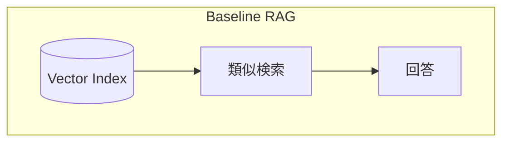

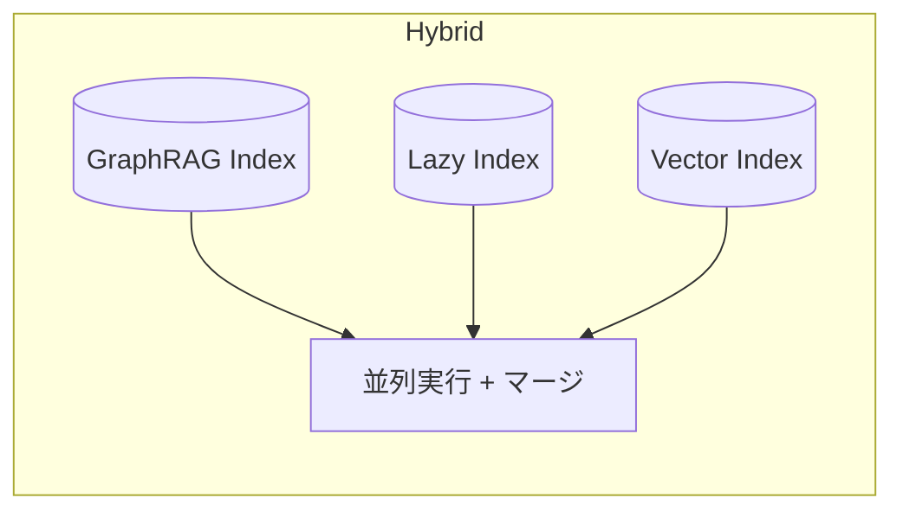

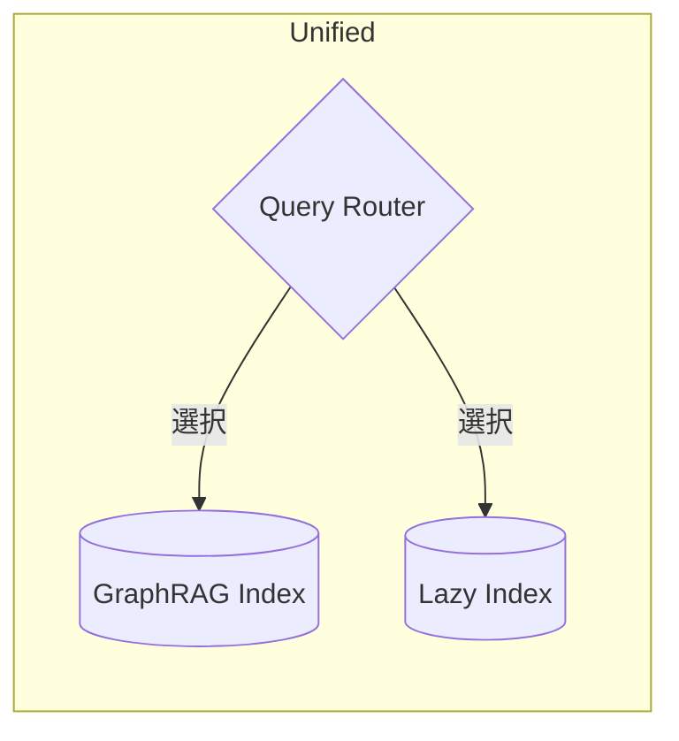

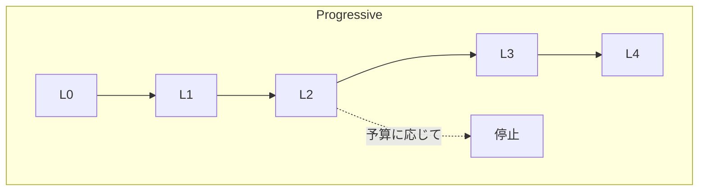

## 全アーキテクチャ比較

6つのアーキテクチャを主要な指標で比較します。**インデックスコスト**は事前準備にかかるコスト、**クエリコスト**は検索時にかかるコストを表します。ユースケースに応じて、どの指標を重視するかを検討してください。

| 指標 | Baseline RAG | GraphRAG | LazyGraphRAG | Hybrid | Unified | Progressive |
|------|-------------|----------|--------------|--------|---------|-------------|
| **インデックスコスト** | 💰 | 💰💰💰💰💰 | 💰 | 💰💰💰💰💰 | 💰💰💰💰💰 | 💰→💰💰💰💰💰 |
| **クエリコスト** | 💰 | 💰💰 | 💰💰💰 | 💰💰💰💰 | 💰💰 | 予算依存 |
| **グローバル質問** | ❌ | ✅✅ | ✅ | ✅✅ | ✅ | ✅ |
| **事実検索** | ✅✅ | ⚠️ | ⚠️ | ✅ | ✅ | ✅ |
| **初期導入** | 簡単 | 困難 | 簡単 | 困難 | 困難 | 簡単 |
| **運用複雑度** | 低 | 中 | 低 | 高 | 高 | 中 |

## 数値比較（Hybrid/Unified/Progressive）

本記事で紹介した応用アーキテクチャ（Hybrid、Unified、Progressive）に絞って詳細に比較します。これら3つは既存の GraphRAG と LazyGraphRAG を組み合わせたアーキテクチャであり、実運用での選択肢となります。

| 指標 | Hybrid | Unified | Progressive |
|------|--------|---------|-------------|
| **インデックス構築コスト** | 高 (両方必要) | 高 (両方必要) | 低→高 (段階的) |
| **クエリコスト (平均)** | 最高 | 中 | 予算依存 |
| **レイテンシ** | 最長 | 中 | 予算依存 |
| **網羅性** | ★★★★★ | ★★★★☆ | ★★★☆☆〜★★★★★ |
| **運用複雑度** | 中 | 高 | 低 |
| **初期導入コスト** | 高 | 高 | 低 |

## 選択フローチャート

どのアーキテクチャを選ぶべきか迷った場合は、以下のフローチャートを参考にしてください。まず「**網羅性が最優先かどうか**」を判断し、次に「**事前にフルインデックスを構築できるか**」を検討することで、最適なアーキテクチャを選択できます。

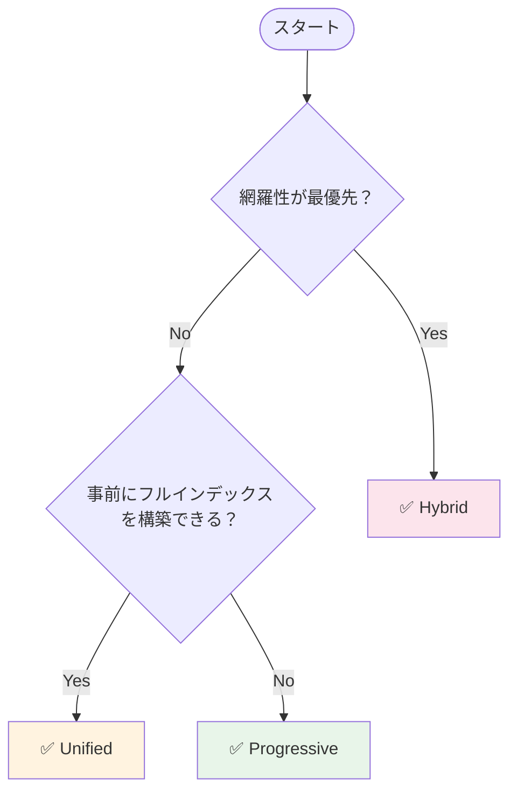

# 7. まとめ

## 基本アーキテクチャ

| アーキテクチャ | キーワード | 推奨シナリオ |
|---------------|-----------|-------------|
| **Baseline RAG** | シンプル・高速・低コスト | 事実検索、シンプルなQA |
| **GraphRAG** | グラフ・構造化・高品質 | グローバル質問、繰り返し検索 |
| **LazyGraphRAG** | 遅延・動的・効率的 | 探索的、ワンオフ検索 |

## 応用アーキテクチャ（Hybrid + 筆者提案）

| アーキテクチャ | キーワード | 推奨シナリオ | 備考 |
|---------------|-----------|-------------|------|
| **Hybrid** | 網羅性・並列・マージ | 品質最優先、評価用途 | 一般的手法 |
| **Unified** | ルーティング・選択・効率 | エンタープライズ、多様なクエリ | 💡 **筆者提案** |
| **Progressive** | 段階的・予算・成長 | スタートアップ、コスト重視 | 💡 **筆者提案** |

GraphRAGの導入を検討する際は、**初期コスト**、**運用コスト**、**品質要件**、**スケーラビリティ**を考慮してアーキテクチャを選択してください。

## おわりに

本記事では、[前回の記事](https://qiita.com/hisaho/items/4b925b07ef82109fd7c7)で紹介した LazyGraphRAG を踏まえ、GraphRAG を実システムに導入する際のアーキテクチャパターンを整理しました。

既存の **Baseline GraphRAG** と **LazyGraphRAG** はそれぞれ優れた特性を持っていますが、実運用においては「どちらを使うべきか」「コストをどう最適化するか」という課題に直面します。本記事で提案した **Unified GraphRAG** と **Progressive GraphRAG** は、これらの課題に対する一つの解答として考案しました。

## AI for Science における適用

**AI for Science** の文脈では、これらのアーキテクチャは**学術論文の検索・分析**に特に有効です。学術論文には以下のような特徴があります。

- 📚 **毎日新しい論文が発行される**: arXiv だけでも1日あたり数百本の論文が投稿される
- 🔗 **論文間の関係性が重要**: 引用関係、共著関係、研究トピックの関連性
- 🌐 **グローバルな俯瞰が必要**: 「この分野の全体的な傾向は？」「主要な研究テーマは？」

このような特性を持つ学術論文検索には、**Progressive GraphRAG** が最も適していると考えます。

| 学術論文の特徴 | Progressive GraphRAG の対応 |
|---------------|---------------------------|
| データが継続的に増加 | 段階的インデックス構築で対応可能 |
| 初期コストを抑えたい | Level 0-1 から開始、必要に応じて深化 |
| 探索的な検索が多い | MINIMAL 予算で低コスト探索 |
| 重要な検索は高品質で | PREMIUM/UNLIMITED で深い分析 |
| 引用関係の把握 | Level 2以上でエンティティ・関係性を抽出 |

例えば、新しい研究分野を探索する初期段階では `MINIMAL` 予算で広く浅く検索し、研究テーマが固まったら `PREMIUM` 予算で深く分析するという使い分けが可能です。また、論文が日々追加されても、既存のインデックスを活かしながら段階的に拡張できます。

今後、MONJYU プロジェクトにおいてこれらのアーキテクチャを実装・検証し、その結果を共有していく予定です。

ご質問やフィードバックがありましたら、コメント欄でお知らせください。

## 参考文献

- [GraphRAG: Unlocking LLM discovery on narrative private data](https://www.microsoft.com/en-us/research/blog/graphrag-unlocking-llm-discovery-on-narrative-private-data/)
- [LazyGraphRAG: Setting a new standard for quality and cost](https://www.microsoft.com/en-us/research/blog/lazygraphrag-setting-a-new-standard-for-quality-and-cost-in-local-graph-rag-methods/)
- [MONJYU Project](https://github.com/nahisaho/MONJYU)
