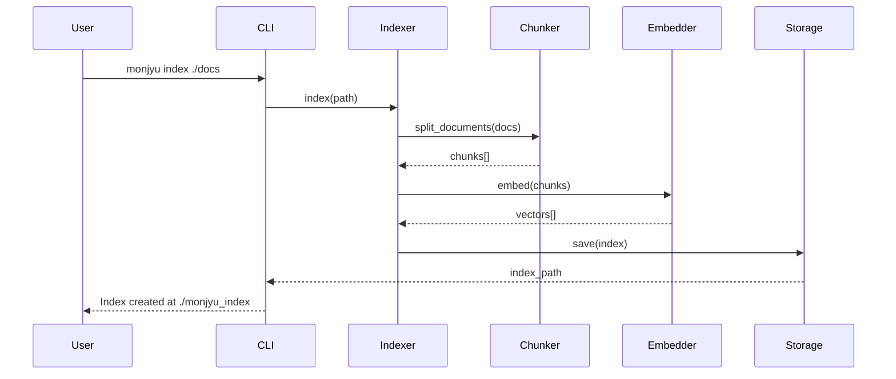
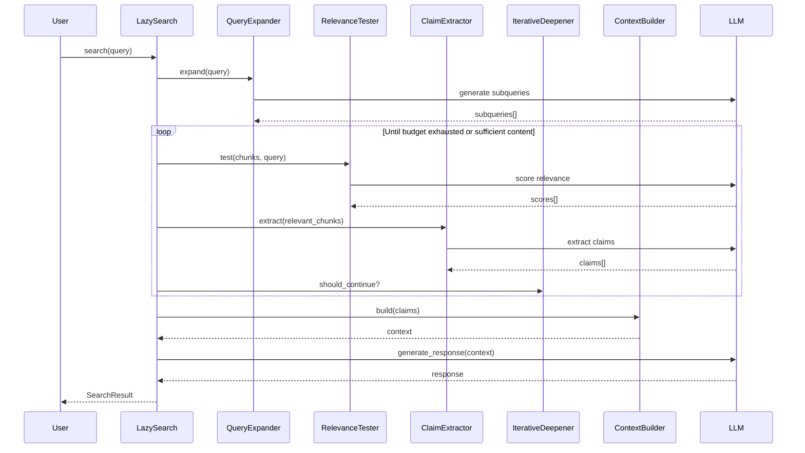

# MONJYU アーキテクチャ設計書

**文書番号**: MONJYU-ARCH-001  
**バージョン**: 1.0.0  
**作成日**: 2025-12-24  
**ステータス**: Draft

---

## 1. システム概要

### 1.1 C4 Model - コンテキスト図

```
┌─────────────────────────────────────────────────────────────────────────────┐
│                              System Context                                  │
├─────────────────────────────────────────────────────────────────────────────┤
│                                                                             │
│    ┌─────────┐         ┌─────────────────┐         ┌─────────────────┐     │
│    │  User   │ ───────▶│     MONJYU      │◀───────▶│   LLM Provider  │     │
│    │(開発者) │         │ LazyGraphRAG    │         │ (OpenAI/Azure)  │     │
│    └─────────┘         └─────────────────┘         └─────────────────┘     │
│         │                      │                                            │
│         │                      │                                            │
│         ▼                      ▼                                            │
│    ┌─────────┐         ┌─────────────────┐                                 │
│    │   CLI   │         │  Vector Store   │                                 │
│    │         │         │ (FAISS/Chroma)  │                                 │
│    └─────────┘         └─────────────────┘                                 │
│                                                                             │
└─────────────────────────────────────────────────────────────────────────────┘
```

### 1.2 C4 Model - コンテナ図

```
┌─────────────────────────────────────────────────────────────────────────────┐
│                                 MONJYU                                       │
├─────────────────────────────────────────────────────────────────────────────┤
│                                                                             │
│  ┌──────────────┐  ┌──────────────┐  ┌──────────────┐  ┌──────────────┐   │
│  │     CLI      │  │  Python API  │  │   REST API   │  │   Web UI     │   │
│  │   (monjyu)   │  │              │  │  (optional)  │  │  (optional)  │   │
│  └──────┬───────┘  └──────┬───────┘  └──────┬───────┘  └──────┬───────┘   │
│         │                 │                 │                 │            │
│         └─────────────────┴─────────────────┴─────────────────┘            │
│                                   │                                         │
│                                   ▼                                         │
│  ┌─────────────────────────────────────────────────────────────────────┐   │
│  │                         Core Engine                                  │   │
│  │  ┌─────────────┐  ┌─────────────┐  ┌─────────────┐                  │   │
│  │  │   Indexer   │  │ LazySearch  │  │   Storage   │                  │   │
│  │  └─────────────┘  └─────────────┘  └─────────────┘                  │   │
│  └─────────────────────────────────────────────────────────────────────┘   │
│                                   │                                         │
│                                   ▼                                         │
│  ┌─────────────────────────────────────────────────────────────────────┐   │
│  │                        Infrastructure                                │   │
│  │  ┌─────────────┐  ┌─────────────┐  ┌─────────────┐                  │   │
│  │  │ LLM Client  │  │VectorStore  │  │   Cache     │                  │   │
│  │  └─────────────┘  └─────────────┘  └─────────────┘                  │   │
│  └─────────────────────────────────────────────────────────────────────┘   │
│                                                                             │
└─────────────────────────────────────────────────────────────────────────────┘
```

---

## 2. コンポーネント設計

### 2.1 レイヤー構成

```
┌─────────────────────────────────────────────────────────────────┐
│                    Presentation Layer                            │
│  ┌───────────┐  ┌───────────┐  ┌───────────┐                    │
│  │    CLI    │  │  API      │  │  Notebooks│                    │
│  └───────────┘  └───────────┘  └───────────┘                    │
├─────────────────────────────────────────────────────────────────┤
│                    Application Layer                             │
│  ┌───────────────────────────────────────────────────────────┐  │
│  │                    MONJYU Facade                           │  │
│  │  index() | query() | configure() | export()               │  │
│  └───────────────────────────────────────────────────────────┘  │
├─────────────────────────────────────────────────────────────────┤
│                      Domain Layer                                │
│  ┌─────────────┐  ┌─────────────┐  ┌─────────────┐             │
│  │   Indexer   │  │ LazySearch  │  │   Storage   │             │
│  │  ┌───────┐  │  │  ┌───────┐  │  │  ┌───────┐  │             │
│  │  │Chunker│  │  │  │Expand │  │  │  │ File  │  │             │
│  │  │Vector │  │  │  │Test   │  │  │  │Vector │  │             │
│  │  │NLP    │  │  │  │Extract│  │  │  │Cache  │  │             │
│  │  └───────┘  │  │  │Deepen │  │  │  └───────┘  │             │
│  └─────────────┘  │  │Build  │  │  └─────────────┘             │
│                   │  └───────┘  │                               │
│                   └─────────────┘                               │
├─────────────────────────────────────────────────────────────────┤
│                   Infrastructure Layer                           │
│  ┌─────────────┐  ┌─────────────┐  ┌─────────────┐             │
│  │ LLM Client  │  │ Embedding   │  │  Tokenizer  │             │
│  │ (Protocol)  │  │  (Protocol) │  │             │             │
│  └─────────────┘  └─────────────┘  └─────────────┘             │
└─────────────────────────────────────────────────────────────────┘
```

### 2.2 データフロー

#### インデックス作成フロー



#### クエリフロー



---

## 3. ディレクトリ構造（目標）

```
MONJYU/
├── __init__.py                 # パッケージエントリーポイント
├── __main__.py                 # CLI エントリーポイント
├── README.md
│
├── specs/                      # 仕様書
│   ├── 01_requirements.md
│   ├── 02_architecture.md
│   ├── 03_components.md
│   └── 04_api.md
│
├── cli/                        # CLI実装
│   ├── __init__.py
│   ├── main.py                 # コマンドルーター
│   ├── index_cmd.py            # index サブコマンド
│   └── query_cmd.py            # query サブコマンド
│
├── config/                     # 設定
│   ├── __init__.py
│   ├── settings.py             # グローバル設定
│   └── lazy_search_config.py   # LazySearch設定（既存）
│
├── index/                      # インデックス作成（新規）
│   ├── __init__.py
│   ├── indexer.py              # メインインデクサー
│   ├── chunker.py              # テキスト分割
│   ├── embedder.py             # ベクトル化
│   └── nlp_extractor.py        # NLPベース抽出
│
├── lazy_search/                # クエリ処理（既存）
│   ├── __init__.py
│   ├── search.py
│   ├── state.py
│   ├── context.py
│   ├── query_expander.py
│   ├── relevance_tester.py
│   ├── claim_extractor.py
│   ├── iterative_deepener.py
│   └── core/                   # スタンドアロンインターフェース
│       ├── chat_model.py
│       ├── tokenizer.py
│       ├── search_result.py
│       ├── conversation.py
│       └── text_utils.py
│
├── storage/                    # ストレージ（新規）
│   ├── __init__.py
│   ├── base.py                 # 抽象ストレージ
│   ├── file_storage.py         # ファイルベース
│   ├── vector_store.py         # ベクトルストア抽象化
│   └── cache.py                # キャッシュ
│
├── llm/                        # LLMクライアント（新規）
│   ├── __init__.py
│   ├── base.py                 # プロトコル定義
│   ├── openai_client.py        # OpenAI
│   ├── azure_client.py         # Azure OpenAI
│   └── ollama_client.py        # Ollama（ローカル）
│
├── prompts/                    # プロンプト（既存）
│   ├── __init__.py
│   └── lazy_search_system_prompt.py
│
├── tests/                      # テスト（既存）
│   ├── unit/
│   ├── integration/
│   ├── e2e/
│   └── benchmarks/
│
└── docs/                       # ドキュメント（既存）
    ├── lazy_search.md
    ├── lazy_search.ipynb
    └── qiita_lazygraphrag.md
```

---

## 4. インターフェース設計

### 4.1 Facade API

```python
class MONJYU:
    """MONJYU メインインターフェース"""
    
    def __init__(
        self,
        config: MONJYUConfig | None = None,
        llm: ChatModel | None = None,
        embedder: EmbeddingModel | None = None,
    ):
        """初期化"""
        pass
    
    # インデックス操作
    def index(
        self,
        source: str | Path | list[str],
        output_dir: str | Path | None = None,
    ) -> IndexResult:
        """ドキュメントをインデックス化"""
        pass
    
    def load_index(self, path: str | Path) -> None:
        """既存インデックスを読み込み"""
        pass
    
    # クエリ操作
    async def search(
        self,
        query: str,
        preset: str = "z500",
        **kwargs,
    ) -> SearchResult:
        """LazySearch を実行"""
        pass
    
    async def search_stream(
        self,
        query: str,
        preset: str = "z500",
        **kwargs,
    ) -> AsyncGenerator[str, None]:
        """ストリーミング検索"""
        pass
    
    # 設定
    def configure(self, **kwargs) -> None:
        """設定を更新"""
        pass
    
    # エクスポート
    def export(
        self,
        format: str = "parquet",
        output_path: str | Path | None = None,
    ) -> Path:
        """インデックスをエクスポート"""
        pass
```

### 4.2 CLI インターフェース

```bash
# インデックス作成
monjyu index ./documents --output ./index --chunk-size 512

# クエリ実行
monjyu query "プロジェクトの概要を教えて" --preset z500

# ストリーミングクエリ
monjyu query "詳細を説明して" --stream

# 設定表示
monjyu config show

# インデックス情報
monjyu info ./index
```

---

## 5. 技術選定

### 5.1 ADR-001: ベクトルストア選択

| 観点 | FAISS | Chroma | LanceDB |
|------|-------|--------|---------|
| パフォーマンス | ◎ | ○ | ◎ |
| 導入容易性 | ○ | ◎ | ○ |
| 永続化 | △ | ◎ | ◎ |
| メモリ効率 | ○ | ○ | ◎ |

**決定**: デフォルトは **LanceDB** (永続化+パフォーマンス)、オプションでFAISS/Chroma

### 5.2 ADR-002: CLI フレームワーク選択

| 観点 | Click | Typer | argparse |
|------|-------|-------|----------|
| 型安全性 | ○ | ◎ | △ |
| 自動補完 | ○ | ◎ | △ |
| 依存追加 | 小 | 小 | なし |

**決定**: **Typer** (型安全、自動ドキュメント生成)

### 5.3 ADR-003: NLP処理

| 観点 | spaCy | NLTK | stanza |
|------|-------|------|--------|
| パフォーマンス | ◎ | ○ | ○ |
| 日本語対応 | ○ | △ | ○ |
| モデルサイズ | 中 | 小 | 大 |

**決定**: **spaCy** (パフォーマンス+多言語)、軽量オプションとしてNLTK

---

## 6. セキュリティ考慮事項

### 6.1 APIキー管理

```python
# 優先順位
1. 環境変数: OPENAI_API_KEY, AZURE_OPENAI_API_KEY
2. 設定ファイル: ~/.monjyu/config.yaml
3. 引数: --api-key (非推奨)
```

### 6.2 データ保護

- インデックスファイルの暗号化オプション
- 一時ファイルの安全な削除
- ログからの機密情報除外

---

## 7. 拡張ポイント

### 7.1 プラグインアーキテクチャ

```python
# カスタムLLMクライアント
class MyLLMClient(ChatModel):
    async def achat(self, prompt: str, **kwargs) -> ModelResponse:
        # カスタム実装
        pass

monjyu = MONJYU(llm=MyLLMClient())
```

### 7.2 カスタムストレージ

```python
# カスタムベクトルストア
class MyVectorStore(VectorStoreProtocol):
    async def search(self, query: list[float], k: int) -> list[dict]:
        # カスタム実装
        pass

monjyu = MONJYU(vector_store=MyVectorStore())
```

---

## 8. 次のステップ

1. **[03_components.md](03_components.md)** - コンポーネント詳細仕様
2. **[04_api.md](04_api.md)** - API仕様書
3. 実装フェーズへ移行

---

**次のドキュメント**: [03_components.md](03_components.md) - コンポーネント仕様書
